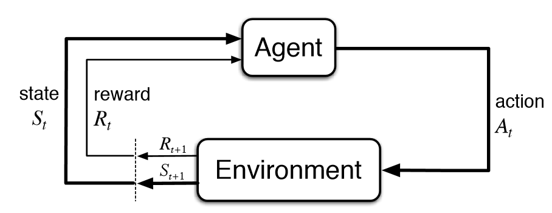

# HumbleRL
Straightforward reinforcement learning Python framework. It will provide all the boilerplate code needed to implement RL logic (see diagram below) with different publicly available environments and own agents (plus e.g. logging).

It's not a deep learning framework! It's designed to work with them to build agents (e.g. PyTorch or TensorFlow).

**Work in progress!** It's not officially released yet.

# How to run?
## Dependencies:
* Python 2.7 (tested). It _should_ work with Python 3 too. 
* numpy - https://scipy.org/install.html
* mock - https://pypi.python.org/pypi/mock
* pytest - https://docs.pytest.org/en/latest/getting-started.html

## Running tests:
Go to root repo dir (must be called `humblerl`) and run `PYTHONPATH=.. py.test`.
